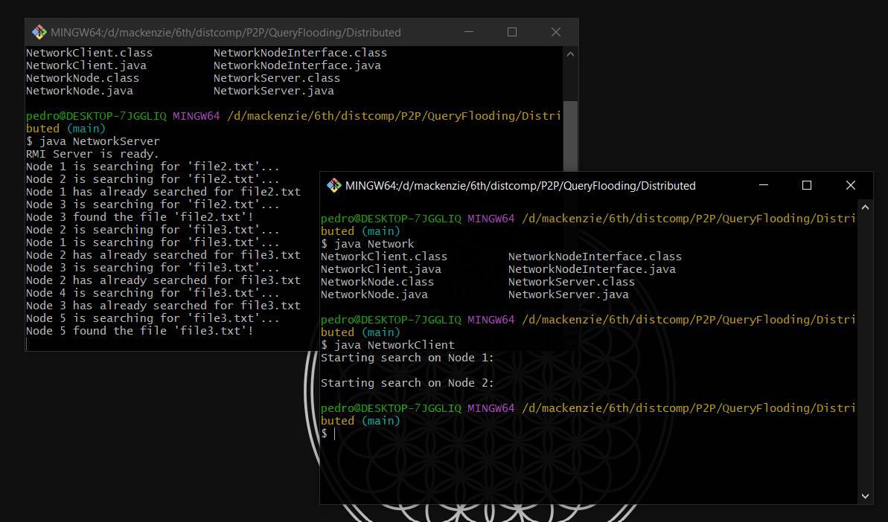

# Implementação: Rede P2P com RMI
NOME: Pedro Henrique Araujo Farias

RA: 10265432

## Como executar este projeto?
No diretório `Distributed`, execute o seguinte comando:

`javac *.java`

Assim, você compilará as classes da aplicação, gerando arquivos `.class`.

Abra um terminal e rode o comando `java NetworkServer` para iniciar o servidor
da Rede P2P.

Em seguida, em outro terminal, execute `java NetworkClient` para executar os
clientes dos nós da Rede P2P.

## Verificando resultados
Caso a execução seja bem sucedida, a saída da aplicação será semelhante à imagem abaixo:

