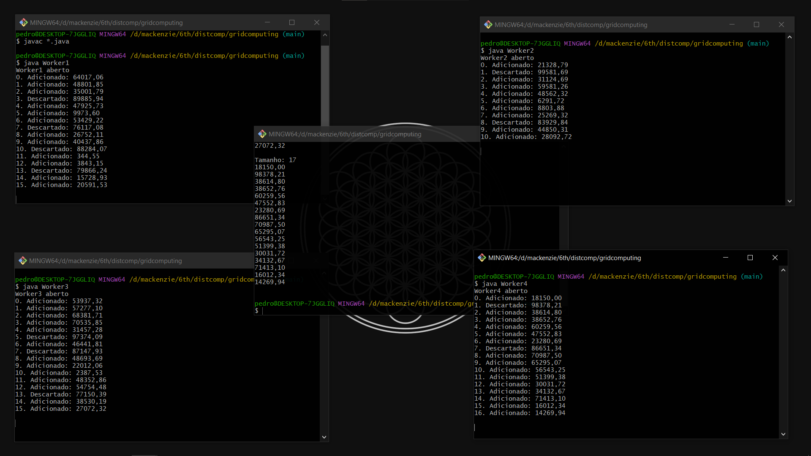

# Implementação: Grid Computing
NOME: Pedro Henrique Araujo Farias

RA: 10265432

## Como executar este projeto?
No diretório `gridcomputing`, execute o seguinte comando:

`javac *.java`

Assim, você compilará as classes da aplicação, gerando arquivos `.class`.

Abra um terminal e inicie cada um dos Workers a partir do comando `java Worker[numero do worker]`

Em seguida, em outro terminal, execute `java Master` para executar o Master do grid.

## Verificando resultados
Caso a execução seja bem sucedida, a saída da aplicação será semelhante à imagem abaixo:

