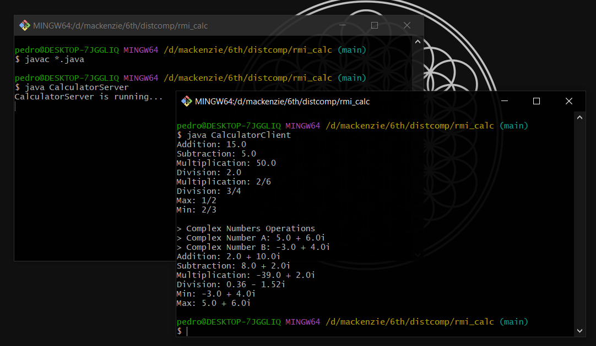

# Implementação: Calculadora RMI com Java

## Como executar este projeto?
No `rmi_calc`, execute o seguinte comando:

`javac *.java`

Assim, você compilará as classes da aplicação, gerando arquivos `.class`.

Abra um terminal e inicie o servidor a partir do comando `java CalculatorServer`

Em seguida, em outro terminal, execute `java CalculatorClient` para executar o cliente da calculadora.

## Verificando resultados
Caso a execução seja bem sucedida, a saída da aplicação será semelhante à imagem abaixo:

